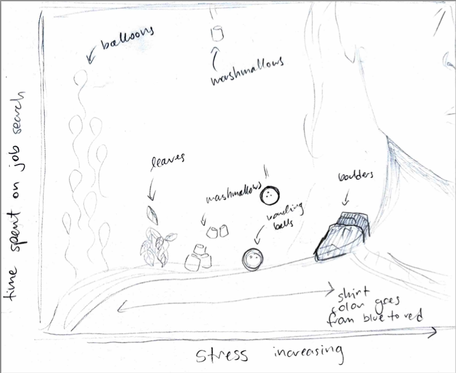
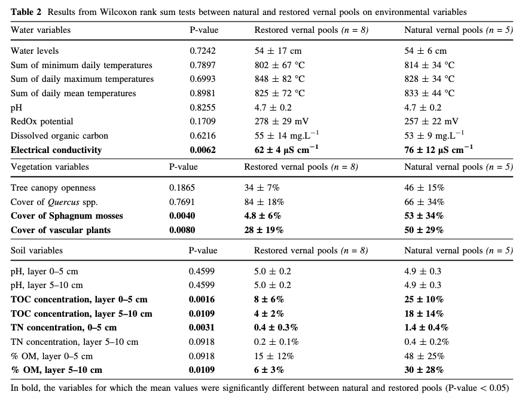

# Part 1: Setting up tasks

## Reading in packages

```{r}
#| label: reading-in-packages
#| message: false
#| warning: false
library(tidyverse)
library(here)
library(janitor)
library(readxl)
```

## Creating data object

```{r}
#| label: creating-kelp-object
#| message: false
#| warning: false

# creating new object for temp-kelp data
kelp <- 
  # reading csv
  read_csv(
    # directing function to data file 
    here("data", "temp-kelp.csv"))

# creating new object for personal data 
job_search <- 
  # reading csv
  read_csv(
    # directing function to data file
    here("data", "personal-data.csv"))
```

# Part 2: Problems

## Problem 1. Giant kelp fronds

***Climate change threatens all ecosystems, including giant kelp (Macrocystis pyrifera) forests.***

***You are interested in the potential relationship between ocean temperature (measured in ° C) and giant kelp frond elongation rate (also known as growth rate, measured in cm day-1).***

***You conduct a field study in which you track giant kelp individuals growing in different temperatures (on average) and measure their elongation rates. Admittedly, this is not a perfect study, but you do the best with what you have!***

### 1a. An appropriate test

***In 1-3 sentences, name the appropriate test(s) to determine the strength of the relationship between temperature and giant kelp frond elongation rate (hint: there are two). Describe the differences between the two tests.***

***Be specific in your response to demonstrate your understanding of the variables in this question.***

Because I solely want to understand the strength of the relationship between temperature and giant kelp frond elongation rate, I want to use a correlation test.

A Pearson's r is used when there is a linear relationship between two variables. A Spearman's rho is used when the relationship between two variables is monotonic.

### 1b. Create a visualization

***Create a visualization that would be appropriate for showing the relationship between temperature and giant kelp frond elongation rate.***

***In addition to using the correct geometries, be sure to:***

-   ***relabel the x- and y-axes and include units***
-   ***use different colors from the ggplot() defaults***
-   ***use a different theme from the ggplot() default***

```{r}
#| label: visualiziation-of-temp-kelp

# creating a new object
temp_kelp_visual <- 
  # base layer: ggplot
  ggplot(
    # df: kelp
    data = kelp,
    # x-axis: temp_c
    # y-axis: kelp_elong
       mapping = aes(x = temp_c,
                     y = kelp_elong)) +
  # first layer: scatterplot
  geom_point(
    # changing color of points
    color = "magenta4") +
  # changing theme
  theme_classic() +
  # changing title and axes' titles
  labs(title = "Kelp frond elongation rates decrease as temp increases",
       x = expression("Temperature ("*~degree*C*")"),
       y = expression("Frond elongation rate (cm per day "^~-1~")"))

# displaying object
temp_kelp_visual
```

### 1c. Check your assumptions and run your test

#### Assumptions

To run a Pearson's r, you want to ensure that there is a linear relationship between the two variables. From the scatter plot I created in part 1b, I can conclude that the relationship mostly appears to be linear.

```{r}
#| label: check-for-linear-relationship

# displaying object from 1b
temp_kelp_visual
```

I also want to make sure that the data is normally distributed. For this, I can create a QQ plot.

```{r}
# creating new object
qqplot_temp <- 
  # baselayer: ggplot
  ggplot(
    # df: kelp
    data = kelp,
    # variable: temp
       aes(sample = temp_c)) +
  # first layer: distribution of temp observations
       stat_qq(distribution=qnorm) +
  # second layer: expected distribution of temp
stat_qq_line( col = "black")

# displaying object
qqplot_temp
```

```{r}
# creating new object
qqplot_kelp <- 
  # first layer: ggplot
  ggplot(
    # df: kelp
    data = kelp,
         # variable: kelp_elong
       aes(sample = kelp_elong)) +
  # first layer: distribution of kelp elongation rate observations
  stat_qq(distribution=qnorm) +
  # second layer: expected distribution of kelp elongation rate
  stat_qq_line( col = "black")

# displaying object
qqplot_kelp
```

It seems that the variables are mostly normally distributed.

Additionally, the variables of kelp frond elongation rates and temperature need to be continuous, which they are since they are not integers, categorical, or ordinal data.

Finally, the observations also need to be independent, which is true because the observations of kelp growth rates do not all come from the same individual.

All of our assumptions have been checked so we can now run the Pearson's r.

#### Pearson's r test

```{r}
#| label: pearsons-r

#correlation test
cor.test(
  # df: kelp
  # first variable: temp
  kelp$temp_c, 
  # df: kelp
  # second variable: kelp elongation rates
         kelp$kelp_elong,
  # type of correlation test: Pearson's r
         method = "pearson")
```

### 1d. Results communication

***In 1-3 sentences each, write about:***

-   ***Which test you used, and why (i.e. “To evaluate the strength of the relationship between temperature and giant kelp frond elongation rate, I used a…”)***
-   ***Your interpretation of your test (along with the appropriate summary of the test in parentheses)***

To analyze the strength of the relationship between temperature and giant kelp frond elongation rate, I used a Pearson's r correlation test.

My results suggest that I can reject the null hypothesis, and that there is a moderate negative relationship between temperature and giant kelp frond elongation rate (Pearson's r = -0.69, t(30) = -5.2, p \< 0.001, $\alpha$ = 0.05).

### 1e. Test implications

***You’re working on a team of people who are also interested in the potential relationships between temperature and giant kelp growth rate, and more broadly giant kelp health. In 2-3 sentences, write what you would communicate to them about the results of this test and what it means for giant kelp growth.***

***Be cognizant of your audience as you are writing: what would they need to know to take action?***

I found a moderate negative (Pearson's r = -0.69) relationship between temperature and giant kelp frond elongation rate. Elongation rates are highest when temperature is below 16 °C and begins to decrease from there. While other factors may influence the overall health of giant kelp, the moderate correlation between temperature and frond elongation rates suggests that understanding changes in temperature and overall climate will be a significant factor in monitoring giant kelp growth.

### 1f. Double check your own work

***In part a, you outlined two potential tests to answer this question about the strength of the relationship between temperature and giant kelp front elongation rate. In part c, you chose a test, checked your assumptions, and ran one.***

***Try running the other test you listed in part a. Include the annotated code and output.***

```{r}
#| warning: false

#correlation test
cor.test(
  # df: kelp
  # first variable: temp
  kelp$temp_c, 
  # df: kelp
  # second variable: kelp elongation rates
         kelp$kelp_elong,
  # type of correlation test: Spearman's rho
         method = "spearman")
```

***In 1-3 sentences, describe whether or not the two tests would have led you to make the same decision (about the null hypothesis) and interpret the results the same way (about the strength of the relationship between temperature and giant kelp front elongation rate).***

***In your description, be specific about the tests, their components, and their relation to the variables.***

Both the Pearson's r and the Spearman's rho correlation tests would have led me to reject the null hypothesis that there is no correlation between temperature and kelp frond elongation rates, because they both had a significant p-value that was less than the significance level of $\alpha$ = 0.05.

Additionally, the resulting r and rho was the same, -0.69, so both tests would lead for me to determine that there is a moderate negative correlation between temperature and kelp frond elongation rates. Both tests result in the same r and rho value because the variables they meet the assumptions of both the Pearson's r and the Spearman's rho.

## Problem 2. Personal data

### 2a. Updating visualizations

#### Effect of outside engagements on job search

```{r}
#| label: visualizing-outside-eng

# creating new object
outside_eng_as_predictor <- 
  # first layer: ggplot
  ggplot(
    # df: job_search
    data = job_search,
       mapping = aes(
         # x-axis: outside engagements
         # y-axis: time spent on job search
         x = outside_eng,
         y = job_search)) +
  # first layer: points
geom_point(color = "midnightblue") +
  # changing the title and axes' titles
  labs(title = "Effect of outside engagements on job search",
       subtitle = "2026-05-27",
       x = "Time spent on outside engagements (hour)",
       y = "Time spent on Job Search (min)") +
  # changing the theme
  theme_bw() +
  # getting rid of visual clutter
  theme(panel.grid.major = element_blank(),
    panel.grid.minor = element_blank())

# displaying the plot
outside_eng_as_predictor
```

#### Effect of stress on outside engagements

```{r}
#| label: visualizing-stress

# creating a new object
stress_as_predictor <- ggplot(data = job_search,
# x-axis: level of stress
# y-axis: time spent on job search
       mapping = aes(x = stress,
                     y = job_search)) +
  # first layer: points
geom_jitter(color = "darkorchid",
            height = 0,
            width = 0.15) +
  # changing title and axes' titles
  labs(title = "Effect of stress on job search",
       subtitle = "2026-05-27",
       x = "Stress (Scale of 0-5)",
       y = "Time spent on Job Search (min)") +
  # changing the theme
  theme_bw() +
  # getting rid of visual clutter
    theme(panel.grid.major = element_blank(),
    panel.grid.minor = element_blank())

# displaying the plot
stress_as_predictor
```

### 2b. Caption writing

**Figure 1: Time spent on job search differs with varying time spent on outside engagements.** Small dark blue points represent an observation of recorded time spent on searching and applying for jobs in a single day. Points are distributed across x-axis, which represents the hours spent on outside engagements, including school (lectures) and work (shifts).

**Figure 2: Time spent on job search differs with varying levels of stress.** Small purple points represent an observation of recorded time spent on searching and applying for jobs. Points are distributed across x-axis, which represents the the level of stress recorded on that day.

*Note: I changed the stress column so that it would be categorical, with a value of 0 meaning I have no assignments or chores (with chores including necessary appointments, extracurricular, or meetings that are not work or school related).* - *0: No assignments or chores (chores including chores, necessary appointments/meetings, or extracurricular activities)*

-   *1: One assignment or chore*
-   *2: Two of either assignments or chores or a mix of both*
-   *3: Three of either assignments or chores or a mix of both*
-   *4: Midterm on that date*
-   *5: Midterm plus one or more of an assignment or chore*

## Problem 3. Affective visualization

### 3a. Describe in words what an affective visualization could look like for your personal data (3-5 sentences).

For my personal data, I would want to use affective visualization to depict how stress affected my job search, based on the jitter plot I created in 2a. This is because I feel like what I personally observed after tracking my data was that perceived stress from my assignments/chores/midterms made me feel less motivated than on days when I was technically busier but felt less stress.

I would want to do an artwork/illustration like Jill Pelto did, where I would represent the x-axis as a shoulder, and the dots would be how much "weight" or stress I feel is on my shoulders. The points/observations closer to the right side where stress is highest would be represented by heavy things, like a rock, while the points to the left could be represented by balloons, to visualize how my job search time increases with decreasing stress, and is more of a "weight off my shoulders."

### 3b. Create a sketch (on paper) of your idea.

 \### 3c. Make a draft of your visualization.

 \### 3d. Write an artist statement.

My piece depicts the relationship between stress and the time I spend searching and applying for jobs. I was influenced by Jill Pelto's paintings, because it allows for a lot of flexibility in the subjects included in the visualization. The form of my artwork is pencil, pen, and marker on paper, and I created my work by first outlining in pencil,then adding shades of color in marker, and then outlining in black pen.

### 3e. Prep your materials to share in class

-   Hyperlink to slides: [affective_visualization_presentation](https://docs.google.com/presentation/d/1qJGBsRYaK_2V60zvN-mt3zw9OEUxZ7EEcaFiCZZSODw/edit?usp=sharing "Affective Visualization presentation")

## Problem 4. Statistical critique

**At this point, you have seen and created a lot of figures for this class. Revisit the paper you chose for your critique and your homework 2, where you described figures or tables in the text. Address the following in full sentences (3-4 sentences each).**

**For this section of your homework, you will be evaluated on the logic, conciseness, and nuance of your critique.**

### 4a. Revisit and summarize

**What are the statistical tests the authors are using to address their main research question? (Note: you have already written about this in homework 2! Find that text and provide it again here!)**

I chose the paper "Monitoring organic-matter decomposition and environmental drivers in restored vernal pools." The test in the paper that I will be focusing on is the Wilcoxon rank sum analysis.

This test allows the authors to compare if there is a significant difference in the median of environmental variables between natural and restored vernal pools. This would help the authors to understand in what ways a restored vernal pool would function differently from a natural vernal pool.

**Insert the figure or table you described in Homework 2 here.**


### 4b. Visual clarity

**How clearly does the table represent the data underlying tests? 2-4 sentences.**

I would say that the visual representation of the data is mostly clear, and it's easy to understand what the variables are, how they are organized into three sections (Water, Vegetation, and Soil), what the p-value is for the Wilcoxon rank sum tests, and the actual observed values for natural and restored pools (with units). However, one thing that decreases the strength of the tables communication is how the significant values are scattered throughout the rows.

Additionally, when I discussed this table with An after homework 2, she pointed out that it was strange for them to use the sum of minimum/maximum daily temperatures, as it appears as though the values of the temperatures are way above what life could reasonably handle. I still haven't found a reason for this in the paper.

### 4c. Aesthetic clarity

**How well did the authors handle “visual clutter”? Is there any bolding/italic text to draw your eye to specific numbers? 2-4 sentences.**

They provided good spacing in between the titles of variables and columns, as well as between the values of the columns themselves, which was good to reduce clutter. Additionally, they bolded the variables that were found to have a significant difference in value between restored and natural vernal pools. One thing that is a little overwhelming is all the variables being represented at once, as it makes it hard to know which ones the authors want you to focus on.

### 4d. Recommendations

**In 2-4 sentences, outline what recommendations would you make to make the figure or table better. What would you take out, add, or change? Provide explanations/justifications for each of your recommendations.**

For my first recommendation, I would put the variables with significant differences at the top of each section, so the viewer would instantly direct their attention to the variables of interest.

For my second recommendation, I would take the average of the minimum/maximum daily temperatures, rather than the sum, to help viewers better understand the overall trend of temperatures in the restored vs. vernal pools with values that are familiar to them.

For my third recommendation I would separate the one table into three tables for each section of variables (Water, Vegetation, and Soil). This way the authors could call attention to the variables within each section that have significant differences, instead of overwhelming the viewer with all the variables at once.


